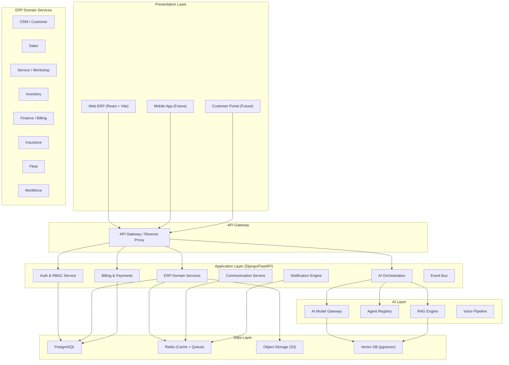
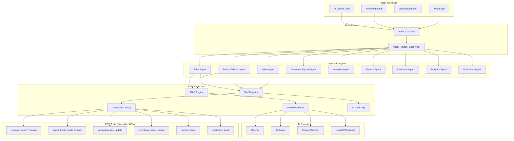

# AutoEra AI — Complete Technical Audit & Transformation Plan

> **Date**: 2026-08-19  
> **Auditor Role**: Principal Architect / CTO / Enterprise ERP Architect  
> **Scope**: Full repository audit per Master Production Transformation Prompt §1–§74

---

## Table of Contents

1. [Executive Summary](#executive-summary)
2. [Current Architecture (§68-A)](#a-current-architecture)
3. [What Works (§68-B)](#b-what-works)
4. [What Is Partially Implemented (§68-C)](#c-what-is-partially-implemented)
5. [What Is Mocked / Fake (§68-D)](#d-what-is-mocked--fake)
6. [What Is Broken (§68-E)](#e-what-is-broken)
7. [What Is Missing (§68-F)](#f-what-is-missing-production-critical)
8. [What Should Be Rewritten (§68-G)](#g-what-should-be-rewritten)
9. [What Should Be Preserved (§68-H)](#h-what-should-be-preserved)
10. [Source-of-Truth Matrix (§2)](#source-of-truth-matrix)
11. [Production Readiness Score (§69)](#production-readiness-score)
12. [Technical Debt Report](#technical-debt-report)
13. [Target Architecture (§4)](#target-architecture)
14. [Database Architecture (§26)](#database-architecture)
15. [API Map (§62)](#api-map)
16. [Frontend Route/Screen Map (§36)](#frontend-routescreen-map)
17. [AI Architecture Map (§17)](#ai-architecture-map)
18. [Dependency Map](#dependency-map)
19. [Migration Plan (§67)](#migration-plan)

---

## Executive Summary

> [!CAUTION]
> **AutoEra AI is currently a frontend-only demo application with NO real backend, NO real database schema, NO real AI integration, NO multi-tenancy, NO payments, and NO security infrastructure.** It is NOT production-ready by any reasonable definition.

### What Exists Today

| Layer | Reality |
|-------|---------|
| **Frontend** | React 19 + Vite SPA with ~60 TSX components. Well-structured UI with Tailwind CSS (CDN). Dashboard shells for Sales, Service, Finance, Insurance, Workforce, Fleet engines. |
| **Backend** | A 94-line Express.js mock server returning hard-coded JSON. No real API server exists. |
| **Database** | A 61-line Supabase SQL script creating 2 tables (`profiles`, `service_jobs`). No ERP schema. |
| **Authentication** | Supabase Auth (email/password) partially wired. No RBAC enforcement. No MFA. |
| **AI** | One mock endpoint (`/api/gemini/generate/`) returning string concatenation. No agent system, no RAG, no vector DB, no model routing. |
| **Payments** | Razorpay checkout script loaded in HTML. No backend payment logic. |
| **Multi-tenancy** | Zero. No `organization_id`, no tenant isolation, no hierarchy. |
| **Tests** | 2 property test files for sales (non-functional — no test runner configured). |
| **CI/CD** | None. |
| **DevOps** | No Dockerfile, no docker-compose, no deployment scripts. Vercel SPA deployment only. |
| **ML Models** | 20 standalone Python scripts (predictive maintenance, lead scoring, etc.) — not integrated. |

### Verdict

**Production Readiness Level: NOT READY (Pre-Alpha Demo)**

The current codebase is a UI prototype / investor demo. Every production system — backend, database, AI, payments, security, multi-tenancy, testing, deployment — must be built from scratch.

---

## A. Current Architecture

### Frontend (React 19 + Vite + TypeScript)

```
index.html (CDN Tailwind + Razorpay checkout script)
  └── index.tsx (React entry)
       └── App.tsx (BrowserRouter + AuthProvider + VoiceProvider)
            ├── LoginScreen.tsx (Supabase email/password auth)
            ├── Sidebar.tsx (8 navigation items, permission-filtered)
            └── Routes:
                 ├── / → Dashboard.tsx
                 ├── /sales → SalesEngine.tsx + 5 sub-pages
                 ├── /service → ServiceLayout + 11 sub-pages
                 ├── /finance → FinanceEngine.tsx + 8 sub-pages
                 ├── /insurance → InsuranceEngine.tsx + 7 sub-pages
                 ├── /workforce → WorkforceEngine.tsx
                 ├── /fleet → FleetEngine.tsx
                 ├── /plans → PlansPage.tsx
                 └── /service-ai → ServiceAIDashboard.tsx
```

**Key observations:**
- All page components contain **hard-coded mock data** — no API calls to a real backend
- TailwindCSS loaded via CDN (`<script src="https://cdn.tailwindcss.com">`) — not production-appropriate
- No lazy loading, no code splitting
- No error boundaries
- No global state management beyond React Context (Auth, Voice)

### Backend

```
mock-backend/
  └── server.js (94 lines, Express, in-memory only)
       ├── POST /api/auth/login/ → Returns mock token
       ├── GET /api/ai-engine/models/ → Returns 2 mock models
       ├── POST /api/ai-engine/predict/ → Returns "mocked-output"
       ├── POST /api/gemini/generate/ → Returns string concat
       ├── GET /api/analytics/revenue/ → Returns { revenue: 12345 }
       └── GET /api/voice/calls/active/ → Returns []
```

**There is no production backend.** The Express mock is a development convenience that returns static data.

### Database

```
SUPABASE_SETUP.sql (61 lines)
  ├── profiles (id, email, business_name, role)
  └── service_jobs (id, user_id, customer_name, vehicle_model, issue, status, priority, technician, bay, estimated_cost)
```

**2 tables total.** No ERP schema. No foreign keys between domain entities. No indexes beyond primary keys.

### Authentication / Authorization

- Supabase Auth with email/password sign-in
- `AuthContext.tsx` maps Supabase session to app `User` type
- `UserRole` type has 6 roles: General Manager, Sales Manager, Service Advisor, Finance Officer, Technician, Super Admin
- **No RBAC enforcement** — permissions array is empty `[]` on login
- No MFA
- No refresh token rotation
- No session management

### AI Integration

| Component | Status |
|-----------|--------|
| Gemini API key | Referenced in vite.config.ts but not in .env |
| AI Chat Modal | UI exists, calls mock endpoint |
| AI Engine API service | 7 endpoint wrappers — all hit the mock server |
| Voice AI Agent | Extensive UI (CallInitiator, LiveCallMonitor, TranscriptionViewer, etc.) — all local state, no real telephony |
| ML Models | 20 Python scripts in `/ML Models/` — standalone, not deployed or integrated |
| RAG | None |
| Vector DB | None |
| Agent System | None |
| Model Router | None |

### Services Layer

| Service | File | Status |
|---------|------|--------|
| API Client | [api.ts](file:///f:/autoeraaisaas-main/services/api.ts) | Axios wrapper with retry — GOOD foundation |
| Auth Service | [auth.ts](file:///f:/autoeraaisaas-main/services/auth.ts) | Token management — duplicated by AuthContext |
| Gemini Service | [geminiService.ts](file:///f:/autoeraaisaas-main/services/geminiService.ts) | Calls mock backend only |
| Voice API | [voiceApi.ts](file:///f:/autoeraaisaas-main/services/voiceApi.ts) | Well-typed interfaces — no backend implementation |
| AI Engine API | [aiEngineApi.ts](file:///f:/autoeraaisaas-main/services/aiEngineApi.ts) | Well-typed interfaces — no backend implementation |
| Analytics API | [analyticsApi.ts](file:///f:/autoeraaisaas-main/services/analyticsApi.ts) | Well-typed interfaces — no backend implementation |
| WebSocket | [websocket.ts](file:///f:/autoeraaisaas-main/services/websocket.ts) | Socket.io client — no server-side implementation |

### Infrastructure

| Concern | Status |
|---------|--------|
| Docker | ❌ None |
| CI/CD | ❌ None |
| Monitoring | ❌ None |
| Logging | ❌ None |
| Secrets Management | ❌ None (env vars only) |
| Backups | ❌ None |
| CDN | ❌ None |
| SSL | Vercel provides by default |

---

## B. What Works

1. **Login / Logout Flow** — Supabase auth email/password works if Supabase is configured
2. **Sidebar Navigation** — Clean, permission-aware (though permissions are empty)
3. **Dashboard UI** — Professional-looking cards, charts (Recharts), KPI displays with mock data
4. **Sales Engine UI** — Leads page, Pricing page, Virtual Showroom, Chatbot, Analytics
5. **Service Engine UI** — Nested routing with ServiceLayout, Bays, Maintenance, Technicians, etc.
6. **Finance Engine UI** — Credit Scoring, Loan Approval, Risk Assessment, Payment Processing, Fraud Detection, Compliance
7. **Insurance Engine UI** — Claims, Damage Assessment, Fraud Detection, Policy Recommendations
8. **Workforce Engine UI** — Employee management with skills, training modules
9. **Fleet Engine UI** — Vehicle tracking, battery health, route optimization
10. **Voice AI UI Components** — CallInitiator, TranscriptionViewer, SentimentDisplay, VoiceCampaignManager
11. **AI Chat Modal** — Global "Ask AI" button with conversational interface
12. **CSV Import Component** — Column mapping, validation, preview
13. **Notification Toast System** — Functional notification display
14. **API Service Layer** — Well-structured Axios wrapper with interceptors and retry
15. **Type System** — Comprehensive TypeScript interfaces for all domains
16. **Plans/Pricing Page** — 3-tier subscription display (Starter/Professional/Enterprise)
17. **PDF Export** — jsPDF integration for report generation
18. **WebSocket Client** — socket.io-client with reconnection logic

---

## C. What Is Partially Implemented

| Feature | UI | API Service | Backend | Database | Business Logic |
|---------|:--:|:-----------:|:-------:|:--------:|:--------------:|
| Authentication | ✅ | ✅ | ⚠️ Supabase | ⚠️ profiles only | ❌ |
| Sales Lead Management | ✅ | ⚠️ Types only | ❌ | ❌ | ❌ |
| Service Job Cards | ✅ | ⚠️ Types only | ❌ | ⚠️ 1 table | ❌ |
| Voice AI | ✅ Extensive UI | ✅ API wrapper | ❌ | ❌ | ❌ |
| AI Predictions | ✅ UI widgets | ✅ API wrapper | ⚠️ Mock | ❌ | ❌ |
| Analytics | ✅ Charts | ✅ API wrapper | ⚠️ Mock | ❌ | ❌ |
| CSV Import | ✅ UI | ❌ | ❌ | ❌ | ❌ |
| Tenant Config | ✅ Modal | ❌ | ❌ | ❌ | ❌ |
| Onboarding | ✅ Modal | ❌ | ❌ | ❌ | ❌ |

---

## D. What Is Mocked / Fake

> [!WARNING]
> **Every single piece of data shown in the application is fake.** This is the most critical finding.

### Hard-Coded Mock Data (Frontend)

All dashboard data comes from [useDashboardData.ts](file:///f:/autoeraaisaas-main/hooks/useDashboardData.ts) which contains a `getMockData()` function returning static objects with `setTimeout` to simulate network latency and `Math.random()` to simulate occasional errors.

**Fake features masquerading as real:**

| Feature | What User Sees | What Actually Happens |
|---------|---------------|----------------------|
| AI-Powered Insights | "AI predicted failure" cards | Hard-coded strings |
| Credit Scoring | Score displays with risk levels | Static mock data |
| Fraud Detection | Fraud risk assessments | Random numbers |
| Damage Assessment | AI damage analysis | Static text |
| Lead AI Scoring | 0-100 scores on leads | Fixed values in code |
| Bay Utilization | Heatmap occupancy data | Random values |
| Technician Efficiency | Performance scores | Static mock |
| Revenue Analytics | Charts, MRR, ARR, ARPU | `revenue: 12345` |
| Voice Sentiment | Emotion analysis | Mock timeline data |
| Battery Health | SOH percentages | Random values |
| OCR Document | Extracted fields with confidence | Static objects |
| Loan Calculator | EMI calculations | Frontend-only math |

### Mock Backend (server.js)

- `/api/auth/login/` → Returns `{ token: "mock-token-<uuid>" }` for ANY credentials
- `/api/ai-engine/predict/` → Returns `{ prediction: "mocked-output", confidence: 0.85 }`
- `/api/gemini/generate/` → Returns string concatenation of input
- `/api/analytics/revenue/` → Returns `{ revenue: 12345 }`

### Fake Payment Integration

- `<script src="https://checkout.razorpay.com/v1/checkout.js">` is loaded in HTML
- No payment processing logic exists anywhere in the codebase
- Plans/Pricing page shows prices but clicking "Subscribe" does nothing functional

---

## E. What Is Broken

1. **Supabase configuration** — `.env` lacks `VITE_SUPABASE_URL` and `VITE_SUPABASE_ANON_KEY`. The app will crash or silently fail on auth
2. **`.env` vs `.env.example` mismatch** — `.env` has `VITE_API_BASE_URL` + `VITE_USE_BACKEND_AI`, `.env.example` has `VITE_API_URL` + Supabase vars
3. **Sidebar permission filtering** — `user.permissions` is always `[]` because `mapSupabaseUser` sets `permissions: []`. All menu items are filtered out for real users
4. **Auth service duplication** — Both [auth.ts](file:///f:/autoeraaisaas-main/services/auth.ts) (localStorage-based) and [AuthContext.tsx](file:///f:/autoeraaisaas-main/context/AuthContext.tsx) (Supabase-based) exist. They conflict
5. **Registration flow** — Clicking "Register" shows `alert("Registration is currently invite-only")`
6. **Google/Microsoft SSO buttons** — UI exists, no backend integration
7. **WebSocket service** — Connects to `ws://localhost:8000` on module import. Mock server doesn't implement Socket.io
8. **Voice Call functionality** — UI exists but `simple-peer` (WebRTC) is configured without signaling server
9. **Tests** — 2 test files exist but no test runner (jest/vitest) is configured in package.json
10. **Service pages with placeholder content** — [ServiceInventoryPage.tsx](file:///f:/autoeraaisaas-main/pages/service/ServiceInventoryPage.tsx) (331 bytes), [SchedulerPage.tsx](file:///f:/autoeraaisaas-main/pages/service/SchedulerPage.tsx) (1105 bytes), [CommunicationPage.tsx](file:///f:/autoeraaisaas-main/pages/service/CommunicationPage.tsx) (1147 bytes) are stubs

---

## F. What Is Missing (Production-Critical)

### MUST BUILD — No Existing Foundation

| # | System | Gap |
|---|--------|-----|
| 1 | **Production Backend** | No Django/FastAPI/Express production server exists |
| 2 | **Database Schema** | 2 tables vs ~100+ required for ERP |
| 3 | **Multi-Tenancy** | Zero tenant isolation — no org hierarchy, no tenant-aware queries |
| 4 | **RBAC** | Roles defined as strings, no permission enforcement anywhere |
| 5 | **Customer Domain** | No customer table, no Customer 360 |
| 6 | **Vehicle Domain** | No vehicle table, no VIN, no lifecycle model |
| 7 | **Sales ERP** | No leads table, no pipeline, no quotation, no booking, no invoice |
| 8 | **Service ERP / Job Cards** | 1 minimal table, no job card states, no workflow |
| 9 | **Workshop Management** | No bay/technician allocation, no scheduling engine |
| 10 | **Inventory & Parts** | No parts master, no stock management, no procurement |
| 11 | **Billing & Finance** | No estimates, invoices, payments, receivables |
| 12 | **Payment Processing** | No gateway integration, no webhook handling, no reconciliation |
| 13 | **SaaS Billing Engine** | No subscription lifecycle, no entitlements, no usage metering |
| 14 | **AI Agent System** | No agent registry, no supervisor, no specialist agents |
| 15 | **AI Model Gateway** | No provider abstraction, no routing, no cost tracking |
| 16 | **RAG / Knowledge System** | No document ingestion, no embeddings, no vector store |
| 17 | **Voice Architecture** | No telephony provider, no STT/TTS, no call recording |
| 18 | **Communication Service** | No WhatsApp, SMS, email sending |
| 19 | **Notification Engine** | Toast only — no persistent notifications, no channels |
| 20 | **Event System** | No domain events, no event bus, no outbox pattern |
| 21 | **Audit Logging** | None |
| 22 | **Security** | No CSRF, no rate limiting, no input validation, no encryption |
| 23 | **Observability** | No structured logging, no metrics, no health endpoints |
| 24 | **CI/CD** | No pipeline, no linting, no automated tests |
| 25 | **Docker** | No containerization |
| 26 | **Backup/DR** | None |
| 27 | **API Documentation** | No OpenAPI spec |
| 28 | **Database Migrations** | No migration tool configured |
| 29 | **Seed/Demo Data** | No seed scripts |
| 30 | **Search** | No global search backend |
| 31 | **Document Management** | No object storage integration |
| 32 | **Report Export** | Frontend-only PDF, no server-side generation |
| 33 | **Import/Migration Engine** | CSV component exists UI-only, no backend processing |
| 34 | **Integration Platform** | No connector framework |
| 35 | **Admin Control Center** | None |
| 36 | **Insurance Domain** | No policy/claim tables |
| 37 | **Procurement** | None |
| 38 | **Workflow Automation Builder** | None |
| 39 | **Data Quality** | No dedup, merge, validation |

---

## G. What Should Be Rewritten

| Component | Action | Justification |
|-----------|--------|---------------|
| TailwindCSS CDN | **Replace** with installed Tailwind or keep vanilla CSS | CDN script is not production-suitable (no tree-shaking, no purging, no version lock) |
| `useDashboardData.ts` | **Rewrite** to call real APIs | Currently returns mock data via `getMockData()` |
| `mock-backend/server.js` | **Replace** with production backend | Mock server provides zero business logic |
| `SUPABASE_SETUP.sql` | **Replace** with proper migration system | 2-table script is inadequate |
| `auth.ts` service | **Remove** or consolidate with AuthContext | Duplicated auth logic — keep Supabase-based AuthContext |
| `geminiService.ts` | **Rewrite** as AI Gateway client | Current implementation just calls mock endpoint |
| All page components with inline mock data | **Refactor** to use API hooks | Pages contain hardcoded data arrays |
| Voice components (simple-peer) | **Rewrite** with proper telephony provider | WebRTC without signaling server doesn't work |
| `index.html` | **Rewrite** — remove CDN scripts, use proper build pipeline | Razorpay CDN + Tailwind CDN are not production patterns |

---

## H. What Should Be Preserved

| Component | Why | Path |
|-----------|-----|------|
| **API Service class** | Well-structured Axios wrapper with retry, interceptors, typed methods | [api.ts](file:///f:/autoeraaisaas-main/services/api.ts) |
| **TypeScript interfaces** | Comprehensive domain type definitions — good starting point | [types.ts](file:///f:/autoeraaisaas-main/types.ts), [types/](file:///f:/autoeraaisaas-main/types/) |
| **UI design system** | Clean enterprise aesthetic, consistent patterns, Inter font | All components |
| **Page layout structure** | Sidebar + header + main content pattern | [App.tsx](file:///f:/autoeraaisaas-main/App.tsx), [Sidebar.tsx](file:///f:/autoeraaisaas-main/components/Sidebar.tsx) |
| **Service Engine nested routing** | Good pattern for multi-tab ERP pages | [ServiceLayout.tsx](file:///f:/autoeraaisaas-main/components/layouts/ServiceLayout.tsx) |
| **Dashboard component library** | KPICard, FunnelChart, HeatMap, TrendChart, ProgressRing | [components/dashboard/](file:///f:/autoeraaisaas-main/components/dashboard/) |
| **Voice API type definitions** | Well-typed interfaces for call, transcription, sentiment | [voiceApi.ts](file:///f:/autoeraaisaas-main/services/voiceApi.ts) |
| **Analytics API types** | Good metric structures for revenue, customers, utilization | [analyticsApi.ts](file:///f:/autoeraaisaas-main/services/analyticsApi.ts) |
| **WebSocket service pattern** | Good reconnection, pub/sub channel pattern | [websocket.ts](file:///f:/autoeraaisaas-main/services/websocket.ts) |
| **CSV Import component** | Column mapping, validation, preview — useful for migration engine | [CsvImportModal.tsx](file:///f:/autoeraaisaas-main/components/common/CsvImportModal.tsx) |
| **ML Model scripts** | 20 Python scripts with real ML logic — can be refactored into services | [ML Models/](file:///f:/autoeraaisaas-main/ML%20%20Models/) |
| **Static design mockups** | 20 UI reference screenshots | [Static/](file:///f:/autoeraaisaas-main/Static/) |
| **Voice adapters pattern** | Engine-specific voice context adapters | [adapters/](file:///f:/autoeraaisaas-main/adapters/) |
| **AuthContext pattern** | Supabase session management, user mapping | [AuthContext.tsx](file:///f:/autoeraaisaas-main/context/AuthContext.tsx) |

---

## Source-of-Truth Matrix

| Area | Architecture Doc | SOP Doc | Master Plan | Code | Conflict | Recommendation |
|------|:---:|:---:|:---:|:---:|----------|---------------|
| **Module Count** | 6 engines | N/A | 12+ modules | 6 engines (Sales, Service, Finance, Insurance, Workforce, Fleet) | Doc says 12, code has 6 | **Start with 6 core → expand to 12** per §52 phasing |
| **AI Agents** | 8 agents | 10+ described | 12 agents | 0 agents built | All documents disagree | **Build 10 core agents** per §18 |
| **Tech Stack** | React + Django + PostgreSQL + AWS | N/A | React + Django | React + Vite + Supabase + Express mock | Architecture doc says Django; code uses Express mock + Supabase | **Django/FastAPI + PostgreSQL** as recommended — existing Express mock is throwaway |
| **Pricing Tiers** | 3 tiers | N/A | 4-5 tiers with usage | 3 tiers (Starter/Professional/Enterprise) | Plan has more granular tiers | **3 tiers + usage-based add-ons** — simpler initial launch |
| **Multi-tenancy** | Org → DealerGroup → Branch | N/A | Similar hierarchy | None implemented | All docs agree on hierarchy | **Implement full hierarchy** per §5 |
| **LLM Strategy** | GPT-4, Claude, Gemini | N/A | Multi-model with Llama | Gemini API key referenced, no actual integration | Docs propose multi-model | **Provider-agnostic gateway** per §21 |
| **Voice Languages** | Tamil, English, Hindi | Tamil, English, Hindi | Tamil, English, Hindi, Telugu | None implemented | Minor language list differences | **Tamil + English + Hindi** — add others via config |
| **Database** | PostgreSQL | N/A | PostgreSQL | Supabase (PostgreSQL) | Consistent | **PostgreSQL** — continue with Supabase or migrate to managed PG |
| **Deployment** | AWS | N/A | AWS | Vercel (frontend only) | Architecture doc says AWS | **AWS or GCP** for production — keep Vercel for frontend preview |
| **Revenue Projections** | ₹2.5Cr ARR Year 1 | N/A | ₹4.3Cr ARR Year 1 | N/A | Documents contradict | **Not an engineering decision** — flag for business |

---

## Production Readiness Score

| Dimension | Score | Evidence |
|-----------|:-----:|----------|
| **Frontend** | 35/100 | UI shells exist with good aesthetics, but all data is mocked, no error boundaries, no loading states for real APIs, no accessibility audit, CDN dependencies |
| **Backend** | 2/100 | Only a 94-line mock server exists. No production backend whatsoever |
| **Database** | 3/100 | 2 tables with minimal schema. No domain model, no migrations, no indexes, no constraints |
| **AI** | 2/100 | Mock endpoint only. No agent system, no RAG, no model routing, no guardrails. ML scripts exist but unintegrated |
| **Security** | 5/100 | Supabase auth provides basic auth. No RBAC enforcement, no CSRF, no rate limiting, no audit, no encryption, no input validation |
| **Payments** | 1/100 | Razorpay script tag loaded. No payment logic anywhere |
| **Multi-tenancy** | 0/100 | Zero tenant isolation. No org_id, no hierarchy, no data scoping |
| **Scalability** | 10/100 | Vite/React is inherently scalable on frontend. No backend to scale |
| **DevOps** | 3/100 | Vercel SPA deployment works. No Docker, CI/CD, monitoring, logging |
| **Testing** | 1/100 | 2 test files with no test runner. 0% coverage |
| **Observability** | 0/100 | No logging, metrics, tracing, health checks |
| **Business Logic** | 5/100 | Type definitions capture domain concepts. No actual business rules implemented |

### Overall Score: **5.6 / 100**

### Rating: **NOT READY — Pre-Alpha UI Prototype**

```
Scale:
  ■□□□□□ NOT READY (0-15)     ← AutoEra is HERE
  □■□□□□ ALPHA (16-30)
  □□■□□□ BETA (31-50)
  □□□■□□ PILOT READY (51-70)
  □□□□■□ PRODUCTION READY (71-85)
  □□□□□■ ENTERPRISE READY (86-100)
```

---

## Technical Debt Report

### Critical Debt (Must Fix Before Any Production Deployment)

| # | Issue | Impact | Effort |
|---|-------|--------|--------|
| 1 | No production backend | Cannot serve real data | XL (8-12 weeks) |
| 2 | No database schema | Cannot persist anything | L (4-6 weeks) |
| 3 | No multi-tenancy | Cannot onboard multiple dealers | L (3-4 weeks) |
| 4 | No RBAC | Any user can access everything | M (2-3 weeks) |
| 5 | All data is mocked | Demo only, no real value | XL (ongoing as features are built) |
| 6 | No payment processing | Cannot monetize | M (2-3 weeks) |
| 7 | TailwindCSS via CDN | Unpredictable builds, no purging | S (1-2 days) |
| 8 | No CI/CD | Cannot deploy safely | M (1-2 weeks) |
| 9 | No tests | Cannot verify correctness | L (ongoing) |
| 10 | No Docker | Cannot deploy consistently | S (2-3 days) |

### Medium Debt

| # | Issue | Impact |
|---|-------|--------|
| 11 | Duplicate auth implementations | Confusion, maintenance burden |
| 12 | No error boundaries | App crashes on component errors |
| 13 | No code splitting/lazy loading | Slow initial load |
| 14 | WebSocket connecting on module import | Unnecessary connections, console errors |
| 15 | `.env` / `.env.example` mismatch | Developer confusion |
| 16 | Empty permissions array | Sidebar shows nothing for real users |
| 17 | No API versioning | Breaking changes will affect clients |
| 18 | 95+ markdown docs in repo root | Repository clutter, outdated information |

---

## Target Architecture

Per §4, the recommended production architecture:



### Technology Recommendations

| Layer | Technology | Rationale |
|-------|-----------|-----------|
| **Frontend** | React 19 + Vite + TypeScript | Keep existing — good foundation |
| **CSS** | Install Tailwind as dependency (not CDN) | Existing code uses Tailwind classes |
| **Backend** | Django + Django REST Framework | Docs recommend it; mature ORM, admin, migrations, auth |
| **Database** | PostgreSQL 16 (Supabase or managed) | Docs recommend it; Supabase already partially used |
| **Cache/Queue** | Redis | Standard choice for caching + Celery task queue |
| **Task Queue** | Celery + Redis | Background jobs, AI processing, notifications |
| **Vector DB** | pgvector extension | Keeps stack simpler, runs on PostgreSQL |
| **Object Storage** | S3 / Supabase Storage | Documents, images, exports |
| **AI Gateway** | Custom Python service | Provider abstraction per §21 |
| **Voice** | Twilio / Exotel | Indian telephony, STT/TTS support |
| **WhatsApp** | WhatsApp Business API (via provider) | Per §23 |
| **Email** | Amazon SES / SendGrid | Transactional email |
| **SMS** | Twilio / MSG91 | Indian SMS |
| **Payments** | Razorpay (primary) + Stripe (future) | Per §15, Razorpay script already referenced |
| **CI/CD** | GitHub Actions | Per existing Git workflow |
| **Containerization** | Docker + docker-compose | Per §53 — start simple |
| **Deployment** | Vercel (frontend) + Railway/Render/AWS (backend) | Per §46 |

---

## Database Architecture

### Schema Domains (~100+ tables needed)

Per §26, organized by domain:

```
identity/
  ├── users
  ├── roles
  ├── permissions
  ├── user_roles
  └── role_permissions

organization/
  ├── organizations
  ├── organization_settings
  ├── organization_branding
  ├── dealer_groups
  ├── dealerships
  ├── branches
  ├── departments
  └── bays

customer/
  ├── customers
  ├── customer_contacts
  ├── addresses
  ├── customer_preferences
  ├── communication_preferences
  ├── customer_documents
  ├── customer_interactions
  └── customer_tags

vehicle/
  ├── vehicles
  ├── vehicle_ownership
  ├── vehicle_service_history
  └── vehicle_insurance

sales/
  ├── leads
  ├── lead_activities
  ├── test_drives
  ├── quotations
  ├── bookings
  ├── sales_orders
  └── trade_ins

service/
  ├── appointments
  ├── job_cards
  ├── job_card_items
  ├── inspections
  ├── estimates
  ├── estimate_items
  └── service_reminders

workshop/
  ├── bays
  ├── bay_allocations
  ├── technician_profiles
  ├── technician_skills
  └── work_logs

inventory/
  ├── parts
  ├── stock_levels
  ├── stock_movements
  ├── purchase_orders
  ├── purchase_order_items
  ├── suppliers
  └── goods_receipts

finance/
  ├── invoices
  ├── invoice_items
  ├── payments
  ├── credit_notes
  ├── receivables
  └── tax_configurations

insurance/
  ├── policies
  ├── claims
  ├── claim_documents
  └── renewals

billing/
  ├── plans
  ├── subscriptions
  ├── entitlements
  ├── usage_records
  ├── billing_invoices
  └── billing_payments

communication/
  ├── messages
  ├── templates
  ├── campaigns
  └── delivery_logs

ai/
  ├── ai_models
  ├── ai_conversations
  ├── ai_actions
  ├── ai_audit_logs
  ├── documents (RAG)
  ├── document_chunks
  └── embeddings

audit/
  ├── audit_logs
  ├── login_logs
  └── security_events
```

---

## API Map

### Required API Endpoints (v1)

```
/api/v1/
├── auth/
│   ├── POST   login/
│   ├── POST   register/
│   ├── POST   logout/
│   ├── POST   refresh/
│   ├── POST   forgot-password/
│   └── GET    me/
│
├── organizations/
│   ├── GET/POST        /
│   ├── GET/PUT/DELETE  /:id/
│   ├── GET/POST        /:id/branches/
│   └── GET/PUT         /:id/settings/
│
├── customers/
│   ├── GET/POST        /
│   ├── GET/PUT/DELETE  /:id/
│   ├── GET             /:id/360/
│   ├── GET             /:id/vehicles/
│   ├── GET             /:id/service-history/
│   └── POST            /merge/
│
├── vehicles/
│   ├── GET/POST        /
│   ├── GET/PUT         /:id/
│   ├── GET             /:id/service-history/
│   └── GET             /search/?vin=&reg=
│
├── leads/
│   ├── GET/POST        /
│   ├── GET/PUT         /:id/
│   ├── POST            /:id/qualify/
│   ├── POST            /:id/assign/
│   └── GET             /pipeline/
│
├── appointments/
│   ├── GET/POST        /
│   ├── GET/PUT         /:id/
│   ├── POST            /:id/cancel/
│   └── GET             /availability/
│
├── service/
│   ├── job-cards/
│   │   ├── GET/POST        /
│   │   ├── GET/PUT         /:id/
│   │   ├── POST            /:id/transition/
│   │   ├── GET             /:id/items/
│   │   └── POST            /:id/estimate/
│   │
│   └── workshop/
│       ├── GET             /dashboard/
│       ├── GET             /bays/
│       ├── POST            /bays/:id/allocate/
│       └── GET             /technicians/
│
├── inventory/
│   ├── parts/
│   │   ├── GET/POST        /
│   │   ├── GET/PUT         /:id/
│   │   └── GET             /:id/stock/
│   │
│   └── purchase-orders/
│       ├── GET/POST        /
│       ├── GET/PUT         /:id/
│       └── POST            /:id/receive/
│
├── finance/
│   ├── invoices/
│   ├── payments/
│   ├── estimates/
│   └── receivables/
│
├── ai/
│   ├── POST    chat/
│   ├── POST    predict/
│   ├── GET     agents/
│   ├── POST    agents/:name/execute/
│   └── GET     conversations/
│
├── voice/
│   ├── POST    calls/initiate/
│   ├── GET     calls/
│   ├── GET     calls/:id/
│   └── POST    calls/:id/end/
│
├── communication/
│   ├── POST    send/
│   ├── GET     templates/
│   └── GET     history/
│
├── notifications/
│   ├── GET     /
│   ├── PUT     /:id/read/
│   └── GET     /unread-count/
│
├── analytics/
│   ├── GET     dashboard/
│   ├── GET     revenue/
│   ├── GET     service/
│   ├── GET     sales/
│   └── POST    export/
│
├── billing/
│   ├── GET     plans/
│   ├── GET/POST subscriptions/
│   ├── GET     usage/
│   └── GET     invoices/
│
├── admin/
│   ├── organizations/
│   ├── users/
│   ├── feature-flags/
│   ├── audit-logs/
│   └── system-health/
│
└── search/
    └── GET     /?q=&type=
```

---

## Frontend Route/Screen Map

### Current Routes (33 routes)

```
/                          → Dashboard
/sales                     → SalesEngine
/sales/leads               → LeadsPage
/sales/showroom            → VirtualShowroomPage
/sales/pricing             → PricingPage
/sales/chatbot             → ChatbotPage
/sales/analytics           → SalesAnalyticsPage
/service                   → ServiceOverviewPage (nested)
/service/bays              → ServiceBaysPage
/service/maintenance       → ServiceMaintenancePage
/service/technicians       → ServiceTechniciansPage
/service/inventory         → ServiceInventoryPage
/service/operations        → OperationsPage
/service/scheduler         → SchedulerPage
/service/communication     → CommunicationPage
/service/quality           → ServiceQualityPage
/service/emergency         → ServiceEmergencyPage
/service/analytics         → ServiceAnalyticsPage
/finance                   → FinanceEngine
/finance/credit-scoring    → CreditScoringPage
/finance/loan-approval     → LoanApprovalPage
/finance/risk-assessment   → RiskAssessmentPage
/finance/payments          → PaymentProcessingPage
/finance/fraud-detection   → FraudDetectionPage
/finance/calculator        → LoanCalculatorPage
/finance/compliance        → CompliancePage
/finance/analytics         → FinanceAnalyticsPage
/insurance                 → InsuranceEngine
/insurance/claims          → ClaimProcessingPage
/insurance/damage-assessment → DamageAssessmentPage
/insurance/fraud-detection → InsuranceFraudDetectionPage
/insurance/policies        → PolicyRecommendationsPage
/insurance/settlement      → SettlementCalculatorPage
/insurance/documents       → DocumentManagementPage
/insurance/analytics       → InsuranceAnalyticsPage
/workforce                 → WorkforceEngine
/fleet                     → FleetEngine
/plans                     → PlansPage
/service-ai                → ServiceAIDashboard
```

### Required Additional Routes (Phase 1)

```
/customers                 → CustomerList
/customers/:id             → Customer360
/vehicles                  → VehicleList
/vehicles/:id              → VehicleDetail
/appointments              → AppointmentCalendar
/job-cards                 → JobCardList
/job-cards/:id             → JobCardDetail
/inventory                 → PartsList
/procurement               → PurchaseOrderList
/invoices                  → InvoiceList
/invoices/:id              → InvoiceDetail
/payments                  → PaymentList
/ai/copilot                → AICopilot
/notifications             → NotificationCenter
/settings                  → Settings
/settings/users            → UserManagement
/settings/roles            → RoleManagement
/settings/organization     → OrgSettings
/settings/billing          → BillingSettings
/admin                     → AdminDashboard (Super Admin only)
/reports                   → ReportBuilder
```

---

## AI Architecture Map

### Current State: None
### Target State (per §17-§22):



---

## Dependency Map

### Frontend Dependencies (package.json)

| Package | Purpose | Keep? |
|---------|---------|:-----:|
| `react` 19.2 | UI framework | ✅ |
| `react-dom` 19.2 | DOM rendering | ✅ |
| `react-router-dom` 7.10 | Routing | ✅ |
| `@tanstack/react-query` 5.20 | Data fetching/caching | ✅ |
| `axios` 1.6 | HTTP client | ✅ |
| `recharts` 3.5 | Charts | ✅ |
| `lucide-react` 0.555 | Icons | ✅ |
| `date-fns` 3.3 | Date utilities | ✅ |
| `jspdf` 2.5 | PDF generation | ✅ |
| `papaparse` 5.4 | CSV parsing | ✅ |
| `xlsx` 0.18 | Excel read/write | ✅ |
| `@supabase/supabase-js` 2.87 | Supabase client | ✅ |
| `@google/genai` 1.30 | Gemini API | ⚠️ Keep for future direct AI calls |
| `socket.io-client` 4.7 | WebSocket | ✅ |
| `simple-peer` 9.11 | WebRTC | ❌ Remove — need proper telephony |

### Missing Dependencies (To Add)

| Package | Purpose |
|---------|---------|
| `tailwindcss` + `postcss` + `autoprefixer` | CSS build pipeline |
| `vitest` + `@testing-library/react` | Testing |
| `zod` | Schema validation |
| `zustand` or `jotai` | Global state management |
| `react-hook-form` | Form management |
| `@tanstack/react-table` | Data tables |

---

## Migration Plan

> [!IMPORTANT]
> This is a **greenfield build** of the backend + a **progressive enhancement** of the frontend. The term "migration" here refers to transforming the demo into a real product.

### Phase 0: Foundation Setup (Weeks 1-2)

- [ ] Set up monorepo structure (`/frontend`, `/backend`, `/infra`, `/docs`)
- [ ] Create Django project with DRF
- [ ] Set up PostgreSQL schema with proper migrations
- [ ] Install Tailwind as npm dependency (remove CDN)
- [ ] Set up Docker + docker-compose
- [ ] Set up CI/CD with GitHub Actions (lint, type-check, build)
- [ ] Configure Vitest for frontend testing
- [ ] Create `.env.example` with all required variables
- [ ] Create environment structure (local, dev, staging, production)

### Phase 1: ERP Foundation (Weeks 3-8)

- [ ] Multi-tenancy: Organization → DealerGroup → Dealership → Branch hierarchy
- [ ] Users, Roles, Permissions (RBAC)
- [ ] Customer domain (Customer 360)
- [ ] Vehicle domain (VIN, lifecycle)
- [ ] Lead management
- [ ] Appointments
- [ ] Service / Job Cards (state machine)
- [ ] Workshop (bay + technician allocation)
- [ ] Inventory / Parts (basic stock management)
- [ ] Billing (estimates, invoices, payments)
- [ ] Notification engine (in-app + email)
- [ ] Audit logging
- [ ] Global search
- [ ] Frontend: Wire all pages to real APIs, remove mock data

### Phase 2: AI Platform (Weeks 9-12)

- [ ] AI Model Gateway (provider abstraction)
- [ ] Agent system (Supervisor + 5 core agents)
- [ ] RAG engine (document ingestion, pgvector)
- [ ] AI Copilot (chat interface → ERP actions)
- [ ] AI tool-call security (policy + permission checks)
- [ ] AI cost tracking and usage metering
- [ ] Voice pipeline (Twilio/Exotel → STT → Agent → TTS)

### Phase 3: Payments & Advanced ERP (Weeks 13-16)

- [ ] SaaS billing engine (plans, subscriptions, entitlements)
- [ ] Razorpay integration (webhooks, reconciliation)
- [ ] Procurement workflow
- [ ] Insurance domain
- [ ] Finance domain (receivables, credit notes)
- [ ] Communication service (WhatsApp, SMS, email)
- [ ] Report export (PDF, Excel, CSV — server-side)
- [ ] Import/migration engine

### Phase 4: Security & Production (Weeks 17-20)

- [ ] Security hardening (rate limiting, CSRF, input validation, encryption)
- [ ] MFA-ready authentication
- [ ] Observability (structured logging, metrics, health endpoints)
- [ ] Backup & disaster recovery
- [ ] Performance optimization
- [ ] Comprehensive test suite (unit, integration, E2E, security)
- [ ] Staging environment
- [ ] Production deployment
- [ ] Seed/demo data generation
- [ ] Admin control center

### Phase 5: Advanced AI & Enterprise (Weeks 21+)

- [ ] Workflow automation builder
- [ ] Predictive maintenance
- [ ] Computer vision (damage detection, OCR)
- [ ] Demand forecasting
- [ ] Dealer Principal AI Brief
- [ ] OEM/dealer-group dashboards
- [ ] API platform (keys, rate limits, documentation)
- [ ] Data quality engine (dedup, merge, validation)

---

## User Review Required

> [!IMPORTANT]
> **Critical Decision: Backend Technology**
> The architecture docs recommend Django. The current mock uses Express.js. Django offers superior ORM, admin panel, migrations, and auth — all critical for ERP. However, if your team has more Node.js expertise, we could consider NestJS or Fastify with Prisma. **Which backend technology does your team prefer?**

> [!IMPORTANT]
> **Critical Decision: Supabase vs Self-Hosted PostgreSQL**
> The current code references Supabase. Supabase provides auth, storage, and postgres out-of-the-box. However, a Django backend would need its own ORM-driven migrations, potentially conflicting with Supabase's schema management. **Do you want to continue with Supabase or move to self-managed PostgreSQL?**

> [!IMPORTANT]
> **Critical Decision: Cloud Provider**
> Architecture docs recommend AWS. **Is AWS confirmed, or should we evaluate GCP/Azure?**

> [!WARNING]
> **This is a 20+ week engineering effort for a team of 4-6 developers.** The current codebase is a UI prototype. Every production system must be built. This should be treated as a new product build with existing UI components as a starting accelerator.

## Open Questions

1. **Team Size & Composition** — How many developers are available? Backend vs frontend split?
2. **Timeline Priority** — Which phase do you need for your first pilot customer? Can we launch with Phase 1 only?
3. **Existing Supabase Project** — Is there an active Supabase project with data, or is the config placeholder?
4. **Telephony Provider** — Any existing relationship with Twilio, Exotel, or other Indian telephony providers?
5. **WhatsApp Business API** — Do you have WhatsApp Business API access or a provider like Gupshup/Interakt?
6. **AI Budget** — What's the monthly budget for LLM API calls (OpenAI/Anthropic/Google)?
7. **First Target Customer** — Is there a specific dealership lined up for pilot? What features do they need most?
8. **Revenue Model Confirmation** — The docs show different ARR targets (₹2.5Cr vs ₹4.3Cr Year 1). Which business model is current?

## Verification Plan

### After Each Phase

1. Run full test suite (`vitest run`)
2. Run linter and type checker (`tsc --noEmit`)
3. Build production bundle (`vite build`)
4. Run database migration verification
5. Verify tenant isolation with multi-tenant test
6. Verify API responses match OpenAPI spec
7. Security scan (dependency audit, OWASP checks)
8. Performance benchmark (lighthouse, API response times)

### Manual Verification

- Deploy to staging environment
- Walk through complete user journey: Login → Create Customer → Create Vehicle → Create Lead → Book Appointment → Create Job Card → Invoice → Payment
- Verify AI Copilot can answer basic questions against real data
- Verify tenant isolation: User A cannot see User B's data
