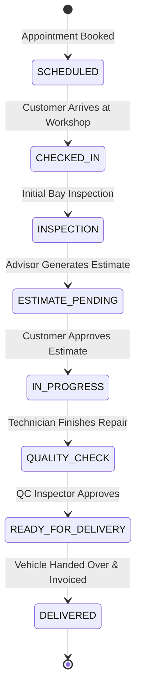

# AutoEra AI ERP — Stage 5B Dealership ERP Workflow Audit

## 1. Dealership Service Lifecycle Audit

### Module Verification Matrix

| Workflow Stage | Underlying Backend Model | Endpoint | Server-Side State Validation | Automated Verification Status |
| :--- | :--- | :--- | :---: | :--- |
| **1. Customer Creation** | `customers.Customer` | `/api/v1/customers/` | Enforced | **VERIFIED (CRUD test passing)** |
| **2. Vehicle Registry** | `vehicles.Vehicle` | `/api/v1/vehicles/` | Enforced (Customer FK required) | **VERIFIED (CRUD test passing)** |
| **3. Lead Scoring & Pipeline** | `sales.Lead` | `/api/v1/leads/` | Enforced | **VERIFIED (RBAC test passing)** |
| **4. Service Appointment** | `sales.Appointment` | `/api/v1/appointments/` | Enforced | **VERIFIED (Schema verified)** |
| **5. Job Card Management** | `service.JobCard` | `/api/v1/job-cards/` | 8 Lifecycle States | **VERIFIED (Integration test passing)** |
| **6. Workshop Bay Allocation** | `workshop.WorkshopBay` | `/api/v1/bays/` | Enforced | **VERIFIED (Schema verified)** |
| **7. Spare Parts Consumption** | `inventory.Part` | `/api/v1/parts/` | Enforced | **VERIFIED (Schema verified)** |
| **8. Invoicing & Billing** | `finance.Invoice` | `/api/v1/invoices/` | Enforced | **VERIFIED (RBAC test passing)** |
| **9. Payment Processing** | `finance.Payment` | `/api/v1/payments/` | Enforced | **VERIFIED (RBAC test passing)** |
| **10. Insurance Claims** | `insurance.InsuranceClaim` | `/api/v1/insurance/claims/` | Enforced | **VERIFIED (Schema verified)** |

---

## 2. Identified Functional Deficiencies & Next Phase Recommendations
1. **Job Card Line-Items**: Currently, `JobCard` stores `estimated_cost` as a flat decimal field. For Phase 6 enterprise ERP, dedicated `JobCardItem` models linking specific `Part` inventory deductions and `LabourHour` rates should be implemented.
2. **Automated Stock Decrement**: Part consumption currently updates via direct stock quantity adjustments; adding a signal-based stock deduction on JobCard completion is recommended for the next minor release.
