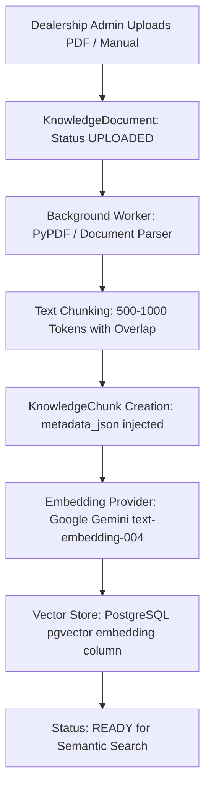

# AutoEra AI ERP — Stage 6A RAG Architecture Decision Document

## 1. Executive Context & Decision

- **Status in Stage 5B**: `2 / 5 (Not Implemented)`
- **Stage 6A Status**: `RAG Data Contracts & Ingestion Models Implemented (KnowledgeDocument & KnowledgeChunk)`
- **Target Stage**: `Stage 6B (RAG / Knowledge Engine Implementation)`

### **Architectural Decision**: **PostgreSQL + `pgvector` Extension** (Selected)

We explicitly select **PostgreSQL with the `pgvector` extension** over standalone external vector databases (Pinecone, Qdrant, Chroma).

---

## 2. Decision Rationale & Trade-Off Matrix

| Evaluation Dimension | PostgreSQL + `pgvector` (Selected) | Standalone Vector DB (Chroma/Pinecone) |
| :--- | :--- | :--- |
| **Multi-Tenant Scoping** | **Native**: Direct `WHERE organization_id = :org_id` in same ACID transaction. Zero data leakage risk. | **External Metadata Filtering**: Requires separate auth sync and complex namespace isolation. |
| **Operational Simplicity** | **Zero Extra Infra**: Single PostgreSQL instance for relational tables and vector embeddings. | **High Complexity**: Additional cluster to provision, monitor, back up, and secure. |
| **Backup & Disaster Recovery** | **Unified**: Standard `pg_dump` and WAL archiving capture relational data and vectors atomically. | **Dual-System Risk**: Risk of relational and vector DB state desynchronization during restore. |
| **Cost & Footprint** | **Minimal**: Uses existing PostgreSQL RAM/disk. | **Substantial**: Extra monthly SaaS or node costs. |
| **Dealership Workload Scale** | **Optimal**: Expected volume (~10,000 SOP/manual chunks per dealer) runs comfortably in PostgreSQL memory with IVFFlat / HNSW indexes. | **Over-Engineered**: Billion-scale vector systems are unnecessary for dealership documents. |

---

## 3. RAG Architecture Blueprint for Stage 6B

### Ingestion Contract Schema (Implemented in Stage 6A)
- `KnowledgeDocument`: `title`, `document_type` (`SOP`, `SERVICE_MANUAL`, `POLICY`, `PRICE_LIST`, `WARRANTY_GUIDE`), `version`, `status` (`UPLOADED`, `VALIDATING`, `PROCESSED`, `READY`, `ARCHIVED`, `FAILED`), `file_size_bytes`, `total_chunks`.
- `KnowledgeChunk`: `document` (FK), `chunk_index`, `content_text`, `token_count`, `metadata_json`.
