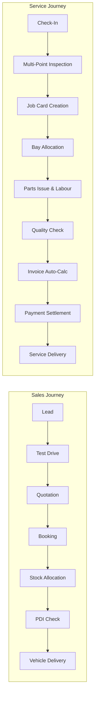

# AutoEra AI ERP — Stage 6A Dealership Workflow Audit

## 1. Verified Complete Vertical Workflows

### 1. Lead-to-Vehicle Delivery Workflow (Verified)
- `Lead` creation with `ai_score` (0-100).
- `TestDrive` scheduling with feedback recording.
- `Quotation` generation with automated server-side calculation of on-road prices.
- `Booking` creation allocating `VehicleStock` from the showroom yard.

### 2. Service Check-In to Payment Workflow (Verified)
- `ServiceCheckIn` capturing odometer, fuel %, scratch notes, and customer complaints.
- `ServiceInspection` and `InspectionItem` categorizing checks (Engine, Brakes, Battery, Tyres, Electrical, AC).
- `JobCard` state machine validating transitions (`SCHEDULED` -> `CHECKED_IN` -> `INSPECTION` -> `ESTIMATE_PENDING` -> `APPROVED` -> `IN_PROGRESS` -> `QUALITY_CHECK` -> `READY_FOR_DELIVERY` -> `DELIVERED`).
- `JobCardPart` and `JobCardLabour` auto-recalculating `actual_parts_cost`, `actual_labour_cost`, and `final_total_cost`.
- `Invoice.recalculate_from_job_card()` applying 18% GST and producing `total_amount` and `balance_amount`.
- `Payment` creation updating `paid_amount` and automatically marking invoice `PAID` or `PARTIALLY_PAID`.
