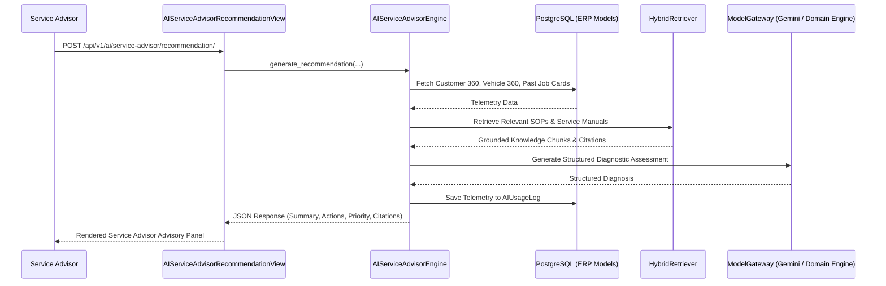

# AutoEra AI ERP — Stage 6B AI Service Advisor Architecture

## 1. Multi-Agent Advisory Workflow



---

## 2. Response Payload Structure

The endpoint `POST /api/v1/ai/service-advisor/recommendation/` produces:
```json
{
  "summary": "Technical Diagnosis for Hyundai Creta: Customer reports brake noise and vibrations above 50 km/h",
  "ai_analysis": "Based on dealership SOP v1, front brake pads must be inspected for wear below 3mm...",
  "priority": "CRITICAL",
  "possible_causes": [
    "Component wear corresponding to mileage and operational symptoms",
    "Fluid level / hydraulic pressure degradation",
    "Associated mechanical or electrical subassembly friction"
  ],
  "recommended_checks": [
    "Visual and torque inspection of affected assembly",
    "Diagnostic OBD-II DTC scan for active or pending error codes",
    "Measure component wear against OEM tolerance specifications"
  ],
  "recommended_actions": [
    "Replace worn consumables in accordance with Dealership Service SOP",
    "Perform calibration and post-repair quality check"
  ],
  "customer_explanation": "We analyzed the symptoms reported on your Hyundai Creta...",
  "knowledge_sources": [
    {
      "document_title": "Horizon Hyundai Brake System SOP",
      "document_type": "SOP",
      "version": 1,
      "chunk_index": 1,
      "section": "Brake System",
      "relevance_score": 0.85
    }
  ],
  "has_grounded_sources": true,
  "confidence_score": 0.92,
  "requires_human_review": true,
  "latency_ms": 28
}
```
