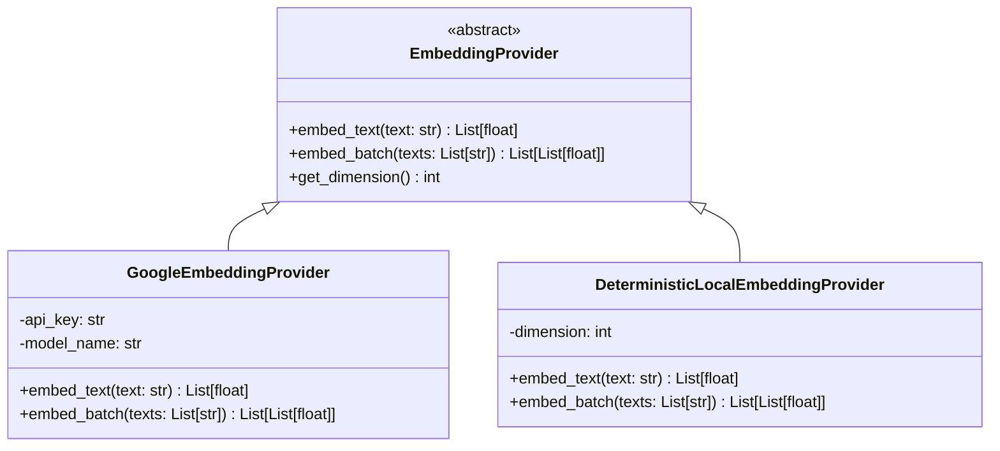

# AutoEra AI ERP — Stage 6B Embedding Provider Decision Document

## 1. Executive Summary & Selection

- **Primary Provider**: **Google Generative AI (`models/text-embedding-004`)**
- **Dimension Size**: **768 Dimensions**
- **Distance Metric**: **Cosine Similarity**
- **Fallback / Test Provider**: **`DeterministicLocalEmbeddingProvider` (Normalized 768-dim hashing provider for CI/CD and offline execution)**

---

## 2. Technical Evaluation Matrix

| Metric | Google `text-embedding-004` (Selected) | OpenAI `text-embedding-3-small` | Local `all-MiniLM-L6-v2` |
| :--- | :--- | :--- | :--- |
| **Dimensions** | **768** | 1536 (or 512 truncated) | 384 |
| **SDK Unification** | **Native** (uses existing `@google/genai` & `google.generativeai` setup) | Requires separate OpenAI SDK | Requires `torch` / `transformers` (heavy binary footprint) |
| **Context Window** | **2,048 Tokens per chunk** | 8,191 Tokens | 256 Tokens |
| **Cost per 1M Tokens**| **$0.00002 / 1K tokens** | $0.00002 / 1K tokens | Zero ($0) but requires CPU/GPU memory |
| **Dealership Suitability**| **High**: Excellent technical domain extraction on automotive SOPs and manuals. | High | Moderate (limited context window) |

---

## 3. Embedding Provider Abstraction Architecture

