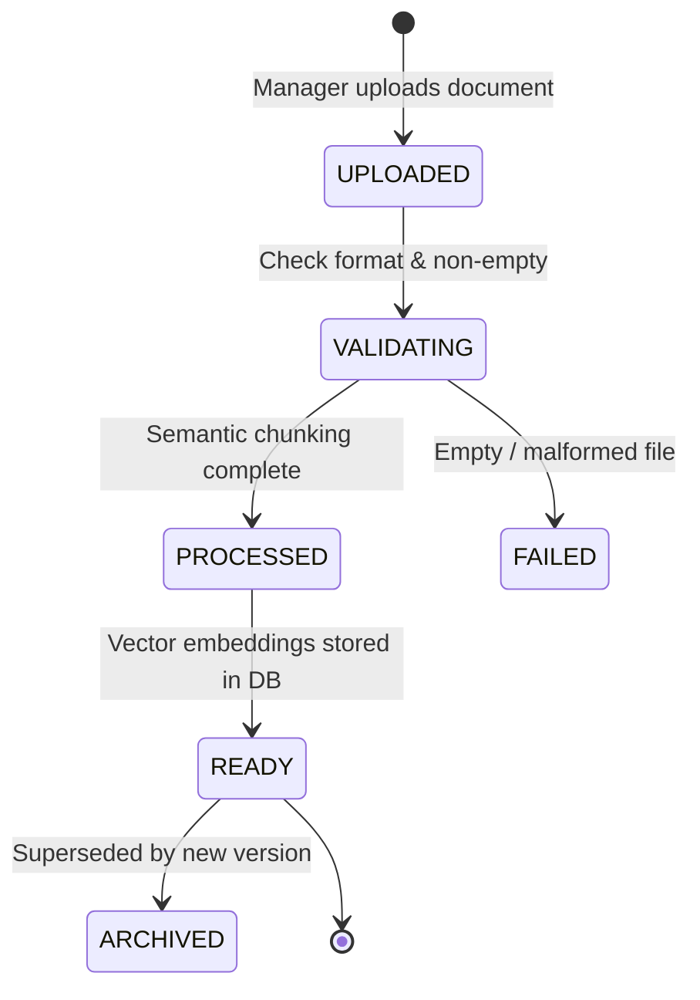

# AutoEra AI ERP — Stage 6B Document Ingestion Pipeline

## 1. Document Lifecycle State Machine

---

## 2. Ingestion Stages

1. **Document Validation**:
   - Rejects empty, whitespace-only, or corrupt text payloads.
   - Enforces valid `document_type` (`SOP`, `SERVICE_MANUAL`, `POLICY`, `PRICE_LIST`, `WARRANTY_GUIDE`, `SALES_BROCHURE`).
2. **Semantic Section & Sliding Window Chunking**:
   - Splits by paragraph breaks and associates heading lines with following content blocks.
   - Ensures chunks do not exceed 150 words with 25-word overlap.
3. **Batch Vector Embedding**:
   - Computes 768-dimensional normalized vectors via active `EmbeddingProvider`.
4. **Atomic Transactional Database Commit**:
   - Deletes prior chunks for the same document version (idempotency).
   - Bulk-inserts `KnowledgeChunk` records preserving `organization_id`, `branch_id`, and `metadata_json`.
   - Sets `KnowledgeDocument.status = 'READY'` and updates `total_chunks`.
