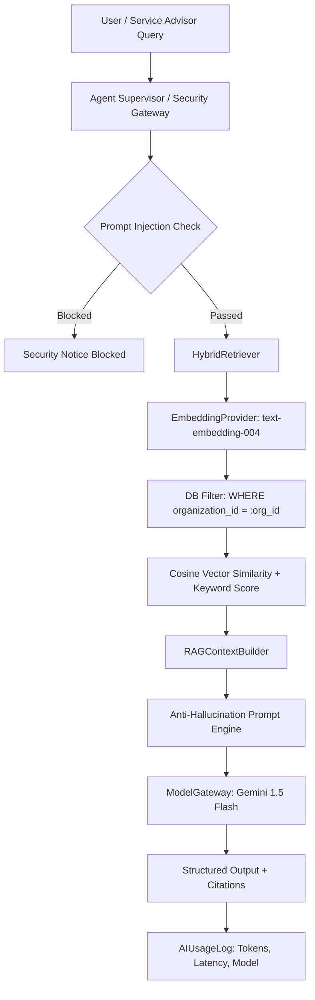

# AutoEra AI ERP — Stage 6B RAG Architecture Specification

## 1. System Overview

AutoEra's RAG Knowledge Engine delivers tenant-isolated, knowledge-grounded artificial intelligence across dealership service, sales, inventory, warranty, and customer operations.

---

## 2. Core Components

1. **`EmbeddingProvider` Abstraction (`ai_platform/embeddings.py`)**:
   - `GoogleEmbeddingProvider`: Production Google GenAI `models/text-embedding-004` (768-dimensional normalized vectors).
   - `DeterministicLocalEmbeddingProvider`: Fast, normalized 768-dimensional fallback for tests and offline resilience.

2. **`DocumentChunker` (`ai_platform/rag.py`)**:
   - Semantic section splitting with automatic markdown header association.
   - Sliding window chunking with configurable overlap (150 words window, 25 words overlap).

3. **`HybridRetriever` (`ai_platform/rag.py`)**:
   - Strictly scopes all queries at the database layer with `organization_id`.
   - Normalizes cosine vector similarity to $[0.0, 1.0]$.
   - Merges keyword frequency scoring with standard functional stop-word filtering.
   - Composite Ranking Formula: $\text{Score} = (0.50 \times \text{Semantic}) + (0.50 \times \text{Keyword})$.

4. **`RAGContextBuilder` & `RAGPromptEngine` (`ai_platform/rag.py`)**:
   - Compiles retrieved text chunks into formatted markdown source blocks.
   - Attaches strict citations: Document Title, Document Type, Version, Section Name.
   - Enforces anti-hallucination guardrail if no source meets the relevance threshold.
