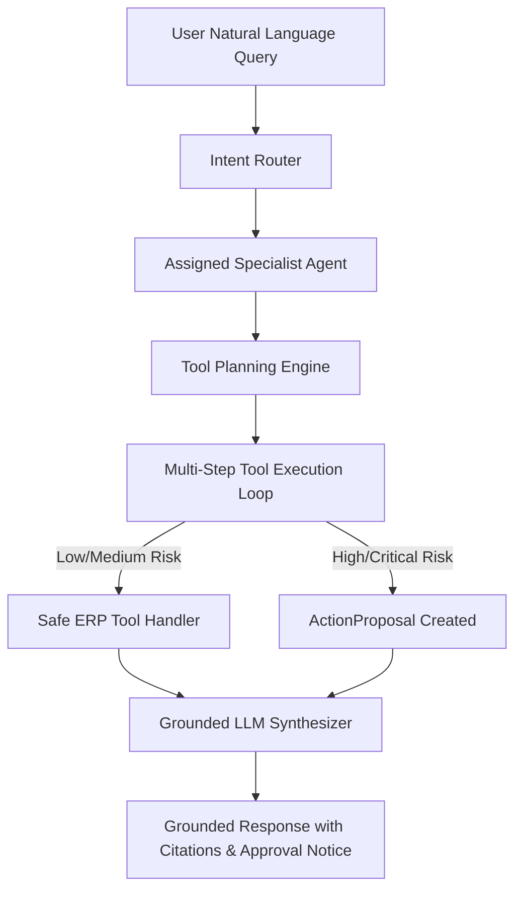

# AutoEra AI ERP — Stage 6C Multi-Agent Architecture

## 1. Specialist Agent Suite

AutoEra AI deploys 7 specialized dealership agents orchestrated by the centralized `AgentSupervisor`:

1. **Service Advisor Agent**: Evaluates customer complaints, vehicle diagnostic records, and past service history grounded against dealership SOPs and OEM service manuals.
2. **Sales Agent**: Assists sales executives with vehicle stock lookups, pricing sheets, test drive availability, and booking status.
3. **CRM Agent**: Manages customer follow-up pipelines, reminders, communication timelines, and lead qualification scores.
4. **Parts Agent**: Provides real-time inventory queries, reorder status alerts, supplier lead times, and compatibility checks.
5. **Finance Assistant**: Analyzes invoice payment status, credit application stages, outstanding receivables, and tax summaries (Read-only initially).
6. **Insurance Assistant**: Tracks policy renewal dates, NCB eligibility, and claims documentation.
7. **Management Copilot**: Synthesizes cross-departmental KPIs, revenue totals, workshop bay utilization, and delayed job analytics for Dealership Principals and General Managers.

---

## 2. Intent Routing & Multi-Step Reasoning Flow

