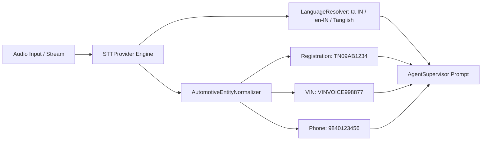

# AutoEra AI ERP — Stage 6D Speech-to-Text & Entity Normalization

## 1. Speech-to-Text Provider (`STTProvider`)

The STT layer transcribes audio streams, detects spoken language (`en-IN`, `ta-IN`, `tanglish`), and executes `AutomotiveEntityNormalizer` before passing user prompts to the AI Supervisor:

---

## 2. Automotive Normalization Rules

- **Spoken Digit Conversion**: `"zero nine one two"` -> `"0912"`.
- **Registration Plate Cleaning**: `"TN 09 AB 1234"` / `"tn09ab1234"` -> `"TN09AB1234"`.
- **VIN Parsing**: Strips non-alphanumeric separators, extracts 17-character uppercase code.
- **Phone Standard**: Standardizes Indian country codes (+91) into 10-digit customer identifiers.
