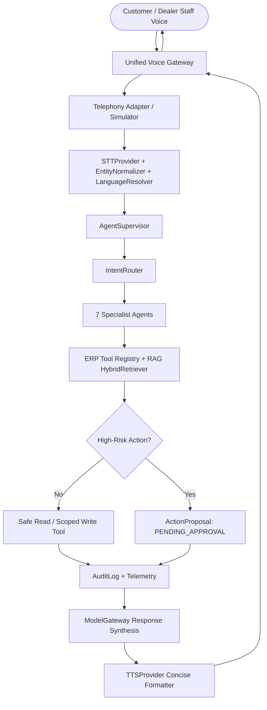

# AutoEra AI ERP — Stage 6D Real AI Voice Architecture

## 1. Unified Voice Gateway & Agent Integration

Voice in AutoEra AI ERP is strictly an **interface layer**, never a separate database-mutating engine:

---

## 2. Core Architectural Invariants

1. **Zero Direct Database Mutation from Voice**: Voice transcription is treated as untrusted user input. All ERP operations route strictly through `ToolRegistry` with role-based validation and tenant isolation.
2. **Reuse of AgentSupervisor**: Voice calls the identical multi-step tool execution loop, cycle detector, and RAG knowledge pipeline established in Stage 6C.
3. **Mandatory Human-in-the-Loop Interception**: High-risk financial operations (`issue_refund`, `approve_estimate`) create an `ActionProposal` in `PENDING_APPROVAL` status and never claim execution before manager approval.
