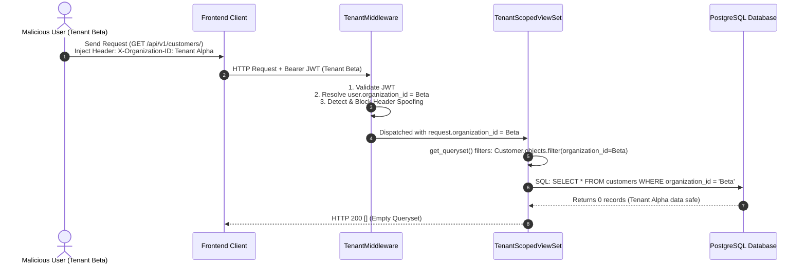

# AutoEra AI ERP — Multi-Tenant Isolation Architecture

## 1. Core Principles

- **Zero Client Trust**: Client-controlled HTTP headers (e.g. `X-Organization-ID`, `X-Branch-ID`) are explicitly stripped and blocked from overriding tenant context.
- **Identity-Derived Isolation**: Tenant context (`organization_id`, `branch_id`) is strictly resolved from the authenticated user's cryptographically signed JWT or database session.
- **ORM-Level Query Restriction**: All tenant-scoped entities inherit from `TenantScopedModel` and are served exclusively via `TenantScopedViewSet` which overrides `get_queryset()` to filter by `organization_id`.
- **Automatic Injection on Creation**: `perform_create()` automatically injects the authenticated tenant ID, ignoring any attacker payload attempts to forge tenant IDs.

---

## 2. Multi-Tenant Request Flow

---

## 3. Database Schema & Indexing Strategy

Every tenant-scoped table features:

1. `id UUID PRIMARY KEY DEFAULT gen_random_uuid()`
2. `organization_id UUID NOT NULL INDEXED`
3. `branch_id UUID NULL INDEXED`
4. `created_at TIMESTAMP WITH TIME ZONE NOT NULL`
5. Composite indexes on `(organization_id, created_at)` and `(organization_id, branch_id)` for high-throughput tenant queries.
